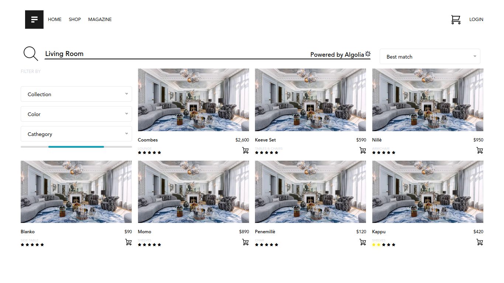

# My Shop

## Description du projet:
Il s'agit d'un site e-commerce integrer avec du html uniquement 

## Aperçu Visuel

## Installation:
Pour intaller le projet vous devez:
- Cloner le repository via le lien ssh ou http (Faire un git clone lien_ssh/http_)
- Ouvrir le projet dans votre editeur de code et le lancer sur le serveur local de votre pc pour l'utiliser

## Demarrage:
- Ouvrir le fichier index.html dans votre navigateur 

## Construit avec:
- HTML/CSS: https://www.w3schools.com/html/default.asp
- Javascript: https://www.w3schools.com/js/default.asp
- Tailwind/CSS: https://tailwindcss.com/docs/installation

## Auteurs:
- **Stone AFEDJOU** alias stonefadel02 sur git
- **Holane SOGLO** alias holanesoglo sur git
- **Sedjro HOUNSINOU** alias HOUNjad95 sur git